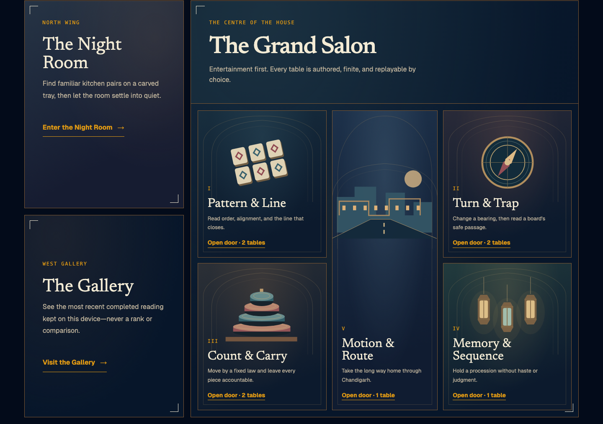

<p align="center">
  
</p>

<p align="center">
  <picture>
    <source media="(prefers-color-scheme: light)" srcset="./apps/site/public/brand/nindova-logo-horizontal-animated-light.svg">
    
  </picture>
</p>

<p align="center"><strong>A house of authored games. A separate room for goodnight.</strong></p>

Nindova is private, offline-ready browser entertainment for adults 18 and over. Five category doors now hold eight finite games in the Grand Salon, including three sourced classic Indian tactical rule studies. The separate Night Room remains a self-ending Masala Mound Session. There is no account, public ranking, advertising, or app telemetry.

<p align="center">
  <a href="https://udhawan97.github.io/Nindova/house/"><strong>Enter the House</strong></a>
  ·
  <a href="https://udhawan97.github.io/Nindova/play/"><strong>Visit the Night Room</strong></a>
  ·
  <a href="https://udhawan97.github.io/Nindova/docs/"><strong>Read the docs</strong></a>
  ·
  <a href="https://github.com/udhawan97/Nindova/releases/tag/v0.4.1"><strong>Tagged downloads</strong></a>
</p>



## Choose your door

|  | Start | Best for | What to expect |
| --- | --- | --- | --- |
|  | [Nindova House](https://udhawan97.github.io/Nindova/house/) | The current live product | Five category doors, eight authored games, the Gallery, and a separate Night Room |
|  | [Night Room](https://udhawan97.github.io/Nindova/play/) | A bounded wind-down Session | Installable Masala Mound PWA with local Dawn |
|  | [Standalone Night HTML](https://github.com/udhawan97/Nindova/releases/download/v0.4.1/nindova-v0.4.1.html) | One portable tagged file | v0.4.1 Night Room only; no service worker |
|  | [Build current source](#run-current-source) | The latest House and Night code | Landing page, docs, both PWAs, and the standalone Night file |

The live site is published from `main`. **v0.4.1 — House Continuity** packages the synchronized landing page, documentation, House, Night Room, and standalone Night file.

## Inside Nindova House

### Grand Salon

Five doors group eight tables. Every table has five fixed chapters, studies, or Acts and a designed curtain call. You replay only by choosing the table again.

- **Pattern & Line** — Pattern Court, plus a placement-only **Navakankari** mill study on the documented 24-point board.
- **Turn & Trap** — Mirror Forge, plus an **Aadu Puli Aattam** goat-and-tiger movement study on the 23-point board documented by the Indian Heritage Centre.
- **Count & Carry** — Stack Architect, plus one-turn **Pallanguzhi** sowing studies on a two-by-seven pit board.
- **Memory & Sequence** — Lantern Ledger's ordered procession of light.
- **Motion & Route** — Sector Sprint's five progressively faster Chandigarh lane routes, harmless Act tools, and complete narrated route.

The classic additions are labeled as authored tactical rule studies. Each shows its named source, documented scope, included mechanics, and omitted full-match rules; Nindova does not present them as definitive or complete traditional matches.

The Salon has no public ranking, streak, randomized prize, social comparison, or assessment result. The local Gallery may keep only the latest completion fact for each game, and you can clear it from the interface.

### Night Room

Masala Mound is a 36-Tile pair-removal exercise inspired by Mahjong solitaire's readable free-tile rule. Choose Gentle or Deeper for tonight, pair matching kitchen forms that are uncovered with an open side, and ask for a safe pair whenever you want.

Every legal choice remains solvable. There is no score, visible timer, grade, collection, missed-night state, or randomized reward. The Session settles itself before its hidden fifteen-minute ceiling. Rest is primary; optional Rasoi Image Drift leads away from the screen and never back into play.

From 06:00 through 11:59 in the captured Night ID zone, a completed Session can return as a local first-light Dawn still or silent loop. No notification asks you back.

## One product, two deliberately separate loops

| House | Night Room |
| --- | --- |
| Adults-only authored entertainment | A bounded behavioral design study |
| Five chapters, studies, or Acts inside each chosen game | One Session that closes itself |
| Latest local completion per game may replace the previous one | Only the latest facts needed for Dawn are retained |
| No assessment, rank, or population comparison | No sleep score, clinical claim, or performance layer |

The Two-Loop Law applies inside the Night Room: satisfaction belongs inside one bounded Session; pull belongs only between Sessions. Anything that makes tonight harder to leave is a bug.

## Private by design

- No account, analytics, advertising, app telemetry, app-controlled remote logging, or third-party runtime service.
- House and Night Room use separate local-storage namespaces, manifests, and service workers.
- The House stores a local adult-audience acknowledgement and at most one replaceable entertainment result per game.
- The Night Room stores only the latest completion facts needed for Dawn, a safe legacy migration when present, and the optional local “Same time tomorrow?” intention.
- Active play lives in same-tab session storage. Dawn images and loops remain local blobs unless you explicitly save or share them.
- Static hosting providers may retain ordinary access logs outside Nindova's control.

## Tagged downloads

The [v0.4.1 release](https://github.com/udhawan97/Nindova/releases/tag/v0.4.1) contains:

- [Standalone Night Room HTML](https://github.com/udhawan97/Nindova/releases/download/v0.4.1/nindova-v0.4.1.html)
- [Complete v0.4.1 static web archive](https://github.com/udhawan97/Nindova/releases/download/v0.4.1/nindova-web-v0.4.1.zip)
- [SHA-256 checksums](https://github.com/udhawan97/Nindova/releases/download/v0.4.1/SHA256SUMS.txt)

Verify only the tagged file you downloaded:

```sh
# Standalone HTML
grep ' nindova-v0.4.1.html$' SHA256SUMS.txt | shasum -a 256 -c -

# Static web archive
grep ' nindova-web-v0.4.1.zip$' SHA256SUMS.txt | shasum -a 256 -c -
```

These are HTML and ZIP files, not signed or notarized native applications. Nindova has no native background updater. Replace a tagged file manually; live PWAs refresh their static caches after a successful online visit.

There is no native macOS, Windows, Linux, iOS, or Android installer. Desktop and mobile support is through a modern browser or PWA. The native iOS Wall remains deferred.

## Run current source

Requires Node.js 24 or newer.

```sh
git clone https://github.com/udhawan97/Nindova.git
cd Nindova
npm install --ignore-scripts
npm run build
npm run preview
```

Then open:

- `http://127.0.0.1:4173/house/` — Nindova House and the Grand Salon
- `http://127.0.0.1:4173/play/` — installable Night Room
- `http://127.0.0.1:4173/docs/` — product and implementation docs
- `dist/nindova.html` — self-contained Night Room file

For focused development, use `npm run dev:house`, `npm run dev:session`, or `npm run dev:site`.

## What Nindova does not claim

Nindova House is authored entertainment, not a cognitive assessment. The Night Room is not a sleep tracker, sleep-performance tool, memory intervention, or treatment. The repository does not prove that Masala Mound makes people sleepy, improves sleep or memory, or creates a useful dopamine response.

Still open: real-device VoiceOver and TalkBack acceptance, broader installed Safari and Android PWA proof, human Punjabi cultural-authenticity review, physical-device QR scanning, and human evidence about calmness, perceived challenge, or typical completion time.

## For contributors

<details>
<summary><strong>Repository map and verification</strong></summary>

- `apps/house/` — Vite + TypeScript House, five category doors, eight Salon games, Gallery, manifest, and scoped worker.
- `apps/session/` — Vite + TypeScript Rasoi engine, Night/Dawn state, export, manifest, and scoped worker.
- `apps/site/` — Astro landing page and Starlight documentation.
- `docs/` — approved plans, ADRs, evidence, research, and release records.
- `graphify-out/` — generated architecture graph and report.
- `reference/` — immutable copies of the original handoff artifacts.
- `tests/` — pure engine, state, browser, PWA, accessibility, and wall-clock gates.

```sh
npm run check
npm test
npm run test:wall-clock
```

Read [CONTEXT.md](./CONTEXT.md), [ADR 0013](./docs/adr/0013-add-the-adult-nindova-house.md), [ADR 0014](./docs/adr/0014-add-a-fail-closed-assessment-readiness-contract.md), [ADR 0015](./docs/adr/0015-add-the-bounded-sector-sprint.md), [ADR 0019](./docs/adr/0019-group-the-grand-salon-and-add-classic-rule-studies.md), and the [Night Room product contract](./apps/site/src/content/docs/docs/product-contract.md) before changing a product boundary.

</details>

## License and visual identity

Nindova code is licensed under the [Apache License 2.0](./LICENSE). Original brand and kitchen artwork is dedicated under CC0-1.0; bundled font licenses are listed in [THIRD_PARTY_NOTICES.md](./THIRD_PARTY_NOTICES.md).

The Shahi Raat system uses a paired-diamond Phulkari lattice, aged brass, jewel colors, and everyday Indian kitchen forms. It excludes flags, sacred symbols, festival collage, pseudo-Gurmukhi, and generic “exotic” ornament. See the [brand guide](./docs/brand/BRAND-GUIDE.md) and [asset manifest](./docs/brand/ASSET-MANIFEST.md).
