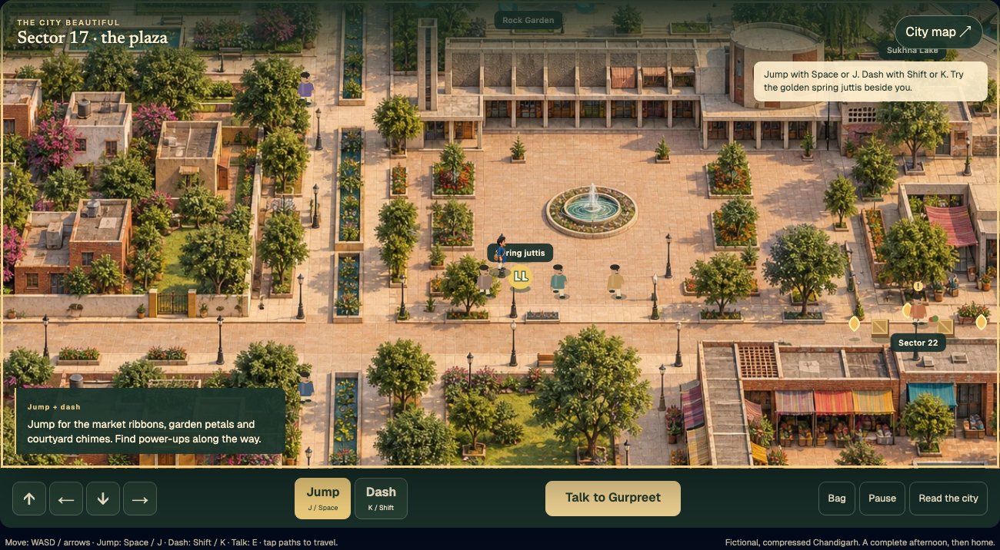

<p align="center">
  
</p>

<p align="center">
  <picture>
    <source media="(prefers-color-scheme: light)" srcset="./apps/site/public/brand/nindova-logo-horizontal-animated-light.svg">
    
  </picture>
</p>

<p align="center"><strong>Every room knows when to close.</strong></p>

Nindova is a private, offline-ready house of authored browser games for adults 18 and over. The Grand Salon has five category doors and eight finite games. A deliberately separate Night Room holds one self-ending Masala Mound Session. There are no accounts, public rankings, ads, or app telemetry.

<p align="center">
  <a href="https://udhawan97.github.io/Nindova/house/"><strong>Enter the House</strong></a>
  ·
  <a href="https://udhawan97.github.io/Nindova/play/"><strong>Visit the Night Room</strong></a>
  ·
  <a href="https://udhawan97.github.io/Nindova/docs/"><strong>Read the docs</strong></a>
  ·
  <a href="https://github.com/udhawan97/Nindova/releases/tag/v0.4.3"><strong>Download v0.4.3</strong></a>
</p>


## Start at the right threshold

| Start | Choose it for | Boundary |
| --- | --- | --- |
| [Nindova House](https://udhawan97.github.io/Nindova/house/) | Eight current authored games and the local Gallery | Five fixed parts per table; replay begins only by choosing again |
| [Night Room](https://udhawan97.github.io/Nindova/play/) | A bounded wind-down Session | Hidden automatic settle and a hard 15-minute ceiling |
| [Standalone Night HTML](https://github.com/udhawan97/Nindova/releases/download/v0.4.3/nindova-v0.4.3.html) | One portable tagged file | Night Room only; no manifest or service worker |
| [Current source](#run-current-source) | The full House, Night Room, site, docs, and standalone output | Requires Node.js 24 or newer |

The live site is built from `main`. **v0.4.3 — Held Boundaries** packages the synchronized House, Night Room, public site, documentation, and standalone Night file. It keeps product behavior intact while concentrating House navigation, Salon lifecycle, Sector Sprint coordination, and browser evidence behind smaller interfaces.

## The Grand Salon

Every table has five fixed chapters, studies, or Acts and a designed curtain call.

| Door | Tables | Authored scope |
| --- | --- | --- |
| Pattern & Line | Pattern Court · Navakankari | Order and placement on a documented 24-point board |
| Turn & Trap | Mirror Forge · Aadu Puli Aattam | Bearing changes and one documented goat-and-tiger passage |
| Count & Carry | Stack Architect · Pallanguzhi | Three-plinth law and one-turn sowing studies |
| Memory & Sequence | Lantern Ledger | One fixed procession of light |
| Motion & Route | Sector Sprint | Five progressively faster Chandigarh lane routes or complete narration |

The three classic additions are explicitly labeled authored tactical rule studies. Each names its source and documented scope and discloses the full-match rules it omits; Nindova does not present them as definitive or complete traditional matches.

Sector Sprint offers an Action route with discrete Up/Down lane movement, optional harmless Act tools, and explicit Hold/Up/Down markers. The Narrated route reaches the same five-Act curtain call without timing, sound, precision movement, or visual interpretation. One architectural contact ends an Action attempt; it creates no life count, checkpoint, failure history, or completion.



The Salon has no score, streak, randomized reward, social comparison, or assessment output. Its Gallery may keep only the latest completion fact for each game, and the whole Gallery can be cleared from the interface.

## The Night Room

Masala Mound is a 36-Tile pair-removal exercise inspired by Mahjong solitaire's readable free-tile rule. Choose Gentle or Deeper for tonight, then match identical kitchen forms that are uncovered with an open side. Help points to a legal pair without playing it.


Every legal choice keeps a path to the ending. There is no score, visible timer, grade, collection, missed-night language, or randomized reward. The whole Session closes itself within 15 minutes. Rest is primary; optional Rasoi Image Drift leads away from the screen and never back into play.

From 06:00 through 11:59 in the captured Night ID zone, a completed Session can return as a local first-light Dawn still or silent loop—only if the person comes back. Nindova sends no notification.

## Two loops, separate on purpose

| House | Night Room |
| --- | --- |
| Adults-only authored entertainment | A bounded behavioral-design study |
| Satisfaction stays inside each finite table | Satisfaction stays inside one bounded Session |
| One replaceable local completion per game | Only narrow facts needed for local Dawn |
| No assessment, rank, or population comparison | No sleep score, clinical claim, or performance layer |

The Two-Loop Law governs the Night Room: satisfaction belongs inside one bounded Session; pull belongs only between Sessions. Anything that makes tonight harder to leave is a bug.

## Private by design

- Runtime requests are same-origin and static. There is no account, analytics, advertising, app telemetry, app-controlled remote logging, or third-party runtime service.
- House and Night Room use separate local-storage namespaces, manifests, workers, and offline caches.
- The House stores a local adult-audience acknowledgement and at most one replaceable entertainment result per game.
- The Night Room stores only the latest completion facts needed for Dawn, safe legacy migration data when present, and an optional local “Same time tomorrow?” intention.
- Active play stays in same-tab session storage. Sector Sprint timing, failures, input, and coordinates are never persisted.
- Dawn images and loops remain local blobs unless explicitly saved or shared.
- A static hosting provider may retain ordinary access logs outside Nindova's control.

## Tagged downloads

The [v0.4.3 release](https://github.com/udhawan97/Nindova/releases/tag/v0.4.3) contains:

- [Standalone Night Room HTML](https://github.com/udhawan97/Nindova/releases/download/v0.4.3/nindova-v0.4.3.html)
- [Complete static web archive](https://github.com/udhawan97/Nindova/releases/download/v0.4.3/nindova-web-v0.4.3.zip)
- [SHA-256 checksums](https://github.com/udhawan97/Nindova/releases/download/v0.4.3/SHA256SUMS.txt)

Verify only the tagged file you downloaded:

```sh
# Standalone HTML
grep ' nindova-v0.4.3.html$' SHA256SUMS.txt | shasum -a 256 -c -

# Static web archive
grep ' nindova-web-v0.4.3.zip$' SHA256SUMS.txt | shasum -a 256 -c -
```

These are ordinary HTML and ZIP files, not signed or notarized native applications. Nindova has no background native updater. Replace a tagged file manually; a live PWA refreshes its static cache after a successful online visit.

There is no native macOS, Windows, Linux, iOS, or Android installer. Desktop and mobile support is through a modern browser or PWA. The native iOS Wall remains deferred.

## Run current source

```sh
git clone https://github.com/udhawan97/Nindova.git
cd Nindova
npm install --ignore-scripts
npm run build
npm run preview
```

Open `http://127.0.0.1:4173/house/`, `/play/`, or `/docs/`. The build also produces the standalone `dist/nindova.html`. Focused development commands are `npm run dev:house`, `npm run dev:session`, and `npm run dev:site`.

## Evidence and limits

The release gate covers deterministic unit rules, all eight rendered House completions, Action and Narrated Sector Sprint routes, keyboard and nonvisual paths, phone and desktop layouts, 200% zoom, reduced motion, same-origin request capture, independently tested House and Night PWA caches, cold-offline entry, and standalone independence.

Automation does not establish human enjoyment, representative perceived difficulty, calmness, sleep or memory benefit, cultural authenticity, or real-device assistive-technology acceptance. Installed Safari and broader Android PWA proof, VoiceOver and TalkBack acceptance, human Punjabi cultural review, and physical-device QR scanning remain open.

Nindova House is entertainment, not a cognitive assessment. The Night Room is not a sleep tracker, treatment, memory intervention, or sleep-performance tool.

<details>
<summary><strong>Contributor map and release gates</strong></summary>

- `apps/house/` — the House shell, navigation transaction, Salon lifecycle, game catalog, Sector Sprint table, state, manifest, and worker.
- `apps/session/` — the Rasoi legality kernel, Night/Dawn state, standalone composition inputs, manifest, and worker.
- `apps/site/` — the Astro landing page and Starlight documentation.
- `docs/` — plans, ADRs, evidence ledgers, research, brand provenance, and release records.
- `graphify-out/` — generated architecture graph and report.
- `reference/` — immutable original handoff artifacts.
- `tests/` — unit and browser journeys using one local evidence harness.

```sh
npm run check
npm test
npm run test:wall-clock
```

Read [CONTEXT.md](./CONTEXT.md), [ADR 0013](./docs/adr/0013-add-the-adult-nindova-house.md), [ADR 0015](./docs/adr/0015-add-the-bounded-sector-sprint.md), [ADR 0019](./docs/adr/0019-group-the-grand-salon-and-add-classic-rule-studies.md), [ADR 0020](./docs/adr/0020-deepen-house-boundaries-and-browser-evidence.md), and the [Night Room product contract](./apps/site/src/content/docs/docs/product-contract.md) before changing a boundary.

</details>

## License and identity

Nindova code is licensed under the [Apache License 2.0](./LICENSE). Original brand and kitchen artwork is dedicated under CC0-1.0; bundled font licenses are listed in [THIRD_PARTY_NOTICES.md](./THIRD_PARTY_NOTICES.md).

The Shahi Raat system uses a paired-diamond Phulkari lattice, aged brass, jewel colors, and everyday Indian kitchen forms. It excludes flags, sacred symbols, festival collage, pseudo-Gurmukhi, and generic “exotic” ornament. See the [brand guide](./docs/brand/BRAND-GUIDE.md) and [asset manifest](./docs/brand/ASSET-MANIFEST.md).
