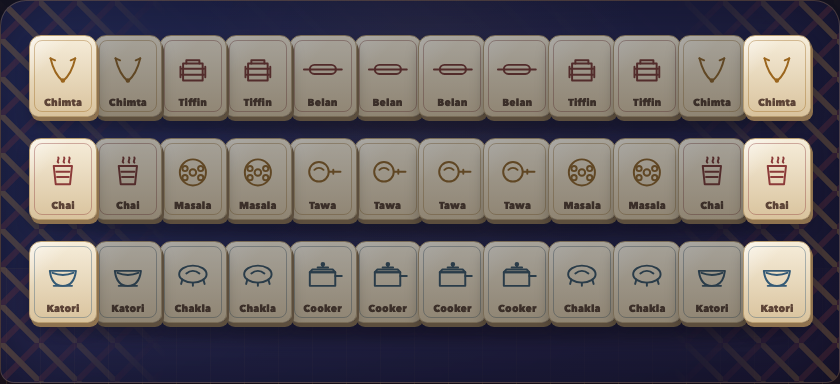

# Nindova

Nindova is a calm, bounded pair-removal game for the end of the day. **Rasoi Pairs** borrows the readable edge-tile rule of Mahjong solitaire and fills the board with everyday Indian kitchen forms: belan, chakla, tawa, chimta, steel katori, tiffin, masala dabba, chai glass, and pressure cooker.

> Nothing to win. Nothing tracked. Nothing you can do wrong.



## Get Nindova

- [Download the standalone Nindova v0.1.0 HTML](https://github.com/udhawan97/Nindova/releases/download/v0.1.0/nindova-v0.1.0.html) — one self-contained file; open it directly in a current browser.
- [Open the v0.1.0 release](https://github.com/udhawan97/Nindova/releases/tag/v0.1.0) — includes the composed website/docs/PWA bundle and checksums.
- Build locally for the installable offline PWA and documentation.

There is no public web deployment. The GitHub release is the distribution surface; `/play/` works after serving the composed release bundle or a local build.

## The experience

- **A legible rule.** Choose two matching tiles only when they are free at the ends of their racks.
- **Guaranteed closure.** The 36-tile board is exhaustively verified: every reachable nonterminal state has a legal pair, and every legal choice remains solvable.
- **Quiet help.** “Show a safe pair” identifies a pair but never removes it.
- **No performance layer.** No score, count, timer, streak, achievement, grade, collection, missed-night state, or randomized reward.
- **A real ending.** Clearing the board closes the Session. If left unfinished, it settles itself before the hidden fifteen-minute ceiling.
- **Dawn, by choice.** From 06:00 through 11:59 in the captured Night ID zone, the previous night’s kitchen forms return as a first-light still and optional silent loop.
- **Voluntary return.** “Not now” leaves Nindova available later that same night; same-night replay uses the identical board and cannot multiply Dawn state.

## Punjabi and Indian direction

The interface uses indigo, madder, marigold, brass, sheesham-toned wood, and restrained phulkari-inspired geometry. The kitchen motifs are code-native SVG forms with visible English names, so the accessible label and drawing remain the same source of truth.

The art direction is Punjabi-inspired. It deliberately excludes flags, sacred symbols, festival collage, and generic “exotic” ornament. A completed human Punjabi cultural-authenticity review is **not** claimed and remains a known release limitation.

## Run locally

Requires Node.js 24 or newer.

```sh
npm install --ignore-scripts
npm run dev:session
```

For the complete landing page, docs, `/play/` PWA, and standalone file:

```sh
npm run build
npm run preview
```

Then open:

- `http://127.0.0.1:4173/play/` — installable Session
- `http://127.0.0.1:4173/docs/` — product and implementation docs
- `dist/nindova.html` — standalone artifact

## Repository map

- `apps/session/` — Vite + TypeScript Rasoi engine, semantic tile interface, Night/Dawn state, export, manifest, and worker.
- `apps/site/` — Astro landing page and Starlight documentation.
- `docs/` — approved redesign, ADRs, evidence ledger, and release/testing records.
- `graphify-out/` — generated architecture graph and report.
- `reference/` — immutable copies of the four original handoff artifacts.
- `tests/` — pure engine, state, browser, PWA, accessibility, and wall-clock gates.

## Verification

```sh
npm run check
npm test
npm run test:wall-clock
```

The main gates prove the exhaustive board invariant, deterministic Night ID, v1/v2-to-v3 local migration, idempotent same-night replay, Dawn eligibility/export fallback, 320–1440px rendered layouts, keyboard operation, 200% zoom, reduced motion, 44px targets, offline PWA closure, standalone independence, same-origin runtime requests, and the real production ceiling.

See [Testing](./apps/site/src/content/docs/docs/testing.md) and the [public-surface evidence ledger](./docs/PUBLIC-SURFACE-EVIDENCE.md) for evidence levels and remaining risk.

## Privacy and local state

Nindova has no account, analytics, telemetry, ads, remote logging, or third-party runtime request. The production Session is static and same-origin.

Long-lived local storage contains one version-3 record with only the latest completion facts needed by Dawn, a safely migrated legacy Dawn variant when present, and the optional local “Same time tomorrow?” intention. Interaction timing exists only in same-tab session storage to enforce resume and closure; it is not written to the long-lived record. Generated images and loops remain local blobs unless the person explicitly saves or shares them.

## Product and evidence boundary

Nindova is a behavioral design study for people aged 13 and up. It is not a sleep tracker, sleep-performance tool, or treatment. Rasoi Pairs has not been clinically shown to make people sleepy, produce a specific dopamine response, or improve sleep. Persistent sleep difficulty deserves evidence-based care such as CBT-I with a qualified clinician.

The browser and standalone surfaces are implemented. The iOS Wall is deferred and is not represented as shipped. Chromium automation covers the release surfaces; broader installed Safari/Android proof, real-device VoiceOver/TalkBack acceptance, and human Punjabi cultural review remain open limitations.

## Contributing

Read [CONTEXT.md](./CONTEXT.md), the [Rasoi redesign plan](./docs/REDESIGN-PLAN.md), and [ADR 0010](./docs/adr/0010-replace-the-vista-arc-with-rasoi-pairs.md) before changing a product boundary. Preserve the Two-Loop Law, the immutable language, zero telemetry, deterministic solvability, and rendered phone/desktop evidence.

## License

No license has been selected. Public source availability does not grant reuse rights beyond applicable law.
